# SourceCodeSimilarity / FinalVer

一个面向 Java 源代码的相似度检测项目，包含命令行入口、可视化 Web 前端以及一套可训练的多维度特征融合算法。核心目标是通过“语法级 token + 结构级 n-gram + 频度向量”来对抗改名、轻微改写等抄袭行为，同时保持实现简单、可移植。

## 项目亮点

- 多维度融合：关键字频度、运算符频度、标识符序列结构、token n-gram、长度相似度联合加权。
- 抗重命名：标识符按首次出现顺序归一化为 `ID0/ID1/...`，提升改名场景的鲁棒性。
- 结构保真：token n-gram 结合 2~8 阶窗口（偏重长 n-gram），捕捉局部结构相似性。
- 轻量化依赖：Java 端不依赖第三方库，HTTP/JSON 解析均手写实现。
- 可训练权重：提供特征导出与 `fit_weights/fit_weights_torch.py` 权重拟合脚本。
- 配套 Web UI：输入/上传两段代码即可交互式显示相似度与等级结论。

## 算法流程（概览）



## 核心算法与实现细节

### 1. 预处理（`Analyzer/Preprocessor.java`）

- 去除单行/多行注释。
- 保留字符串/字符字面量边界，但剔除其内部内容。
- 目的：减少注释与字面量噪声对相似度的干扰。

### 2. 词法分析（`Analyzer/Lexer.java`）

- 识别标识符/关键字（字母或下划线开头）。
- 识别运算符（最长匹配策略：3 字符 > 2 字符 > 1 字符）。
- 数字字面量被忽略（降低与业务数值相关的干扰）。

### 3. 特征提取

- 关键字频度：统计 50 个 Java 关键字出现次数并向量化。
- 运算符频度：统计常见运算符，但**不计入**括号/分隔符等结构性符号。
- 标识符序列结构：
  - 从 token 流中提取标识符序列；
  - 按首次出现顺序归一化为 `ID0/ID1/...`；
  - 对 ID 序列做 2~6 阶 n-gram 余弦相似度融合。
- 归一化 token n-gram：
  - 将所有标识符映射为 `IDk`；
  - 排除 `true/false/null` 等字面量；
  - 对 2~8 阶 n-gram 做余弦相似度，并偏重长 n-gram。
- 长度相似度：使用 token 数量的 `min/max` 比值衡量规模差异。

### 4. 相似度融合（`SimilarityCalculator.java`）

各维度使用余弦相似度后按权重加权求和：

```
similarity =
  0.368208 * kwSim +
  0.055308 * idSim +
  0.118788 * opSim +
  0.148921 * seqSim +
  0.308775 * lenSim
```

权重来自 `fit_weights/fit_weights_torch.py` 对标注数据的拟合结果。

## Web 交互流程



服务端提供 API：`POST /api/similarity`  
请求体示例：

```json
{"code1":"...","code2":"..."}
```

响应示例：

```json
{"similarity":0.753412}
```

说明：JSON 解析为手写简易逻辑，仅支持字符串字段，复杂嵌套不被支持。

## 快速开始

### 1) 命令行计算相似度

```bash
javac Main.java SimilarityCalculator.java Analyzer/*.java DataStructure/*.java Constants/*.java
java Main path/to/A.java path/to/B.java
```

### 2) 启动 Web 服务

```bash
./run.sh 8080
```

浏览器访问 `http://localhost:8080` 即可使用 UI。

## 权重拟合与特征导出

### 导出特征

```bash
javac FeatureDump.java SimilarityCalculator.java Analyzer/*.java DataStructure/*.java Constants/*.java
java FeatureDump path/to/A.java path/to/B.java
```

输出为单行 JSON（含 kw/id/op/seq/len 等特征）。

### 拟合权重

```bash
python fit_weights/fit_weights_torch.py --labels fit_weights/labels_all.json
```

注意：`fit_weights/labels_all.json` 中的样本路径默认指向 `../TestCode`，请确保数据集路径存在。

## 目录结构

```
Analyzer/            预处理、词法分析、n-gram、关键字/运算符/标识符分析
Constants/           Java 关键字与运算符常量
DataStructure/       自研 ArrayList/HashMap/HashSet/FrequencyVector 等
Server/              HTTP 服务入口
Web/                 前端页面与脚本
diagrams/            流程图（mermaid + SVG）
fit_weights/         权重拟合脚本与标注数据
FeatureDump.java     特征导出工具
SimilarityCalculator.java  相似度核心逻辑
Main.java            命令行入口
```

## 设计取舍与限制

- 仅针对 Java 源码，不进行 AST 级语义分析。
- 词法分析为轻量实现，对极端语法边界的覆盖不如完整编译器。
- 以“结构 + 统计”组合为主，适合抄袭检测与大致相似性评估，不适合作为编译级等价判定。

## 可能的扩展方向

- 引入 AST 或 CFG 级特征以提升语义对齐能力。
- 支持多语言（将 `JavaConstants` 抽象为语言配置）。
- 将特征向量与模型训练流程模块化，支持替换权重/策略。
